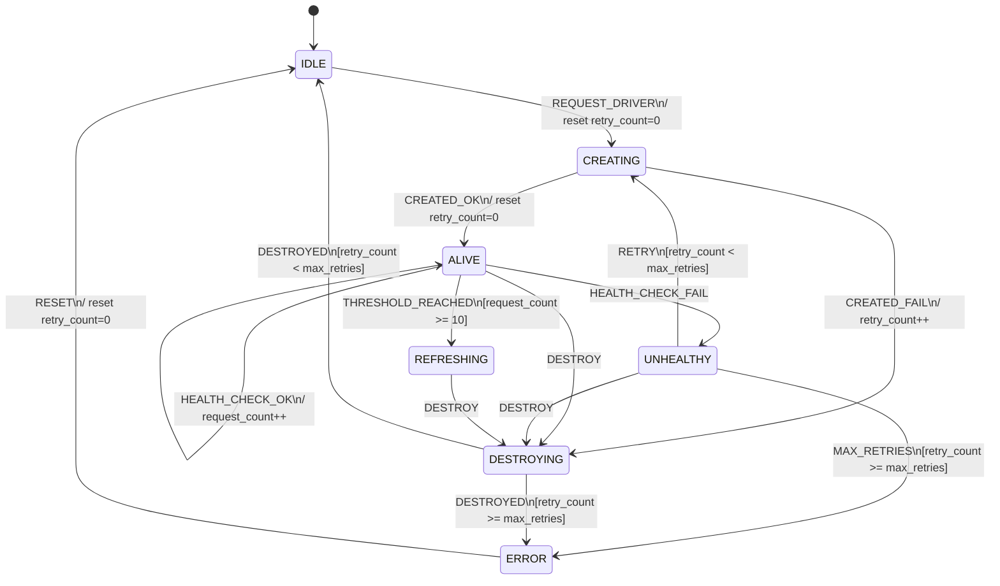
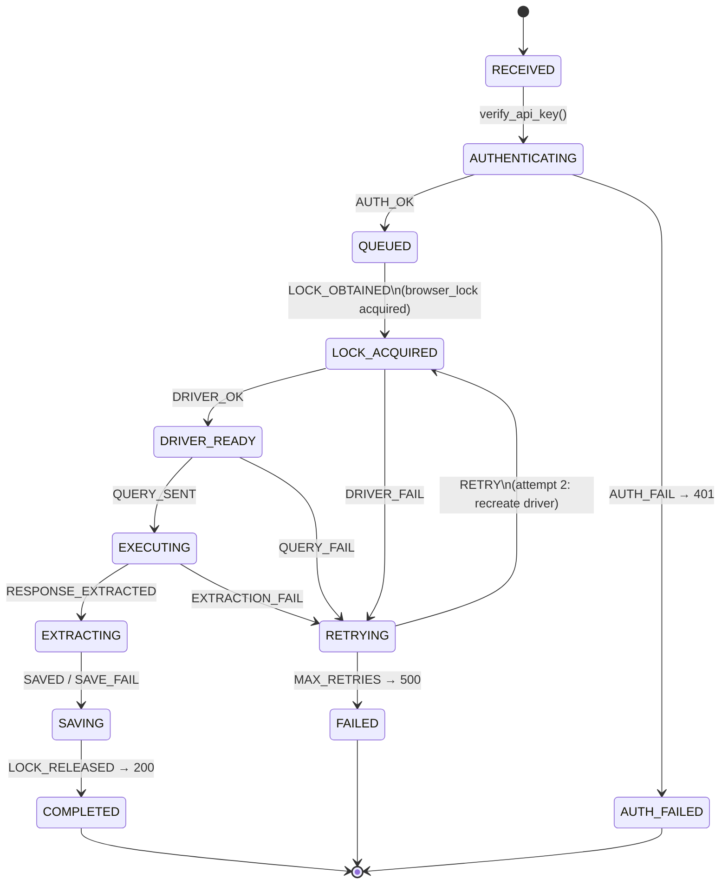
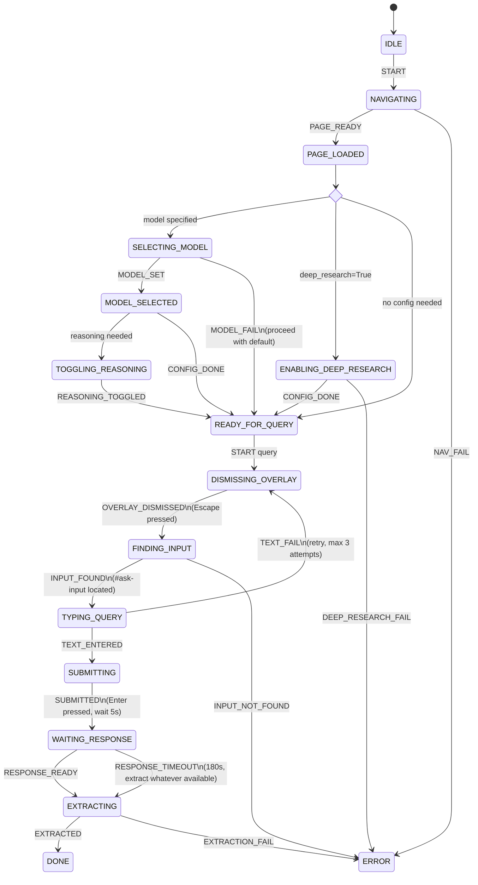
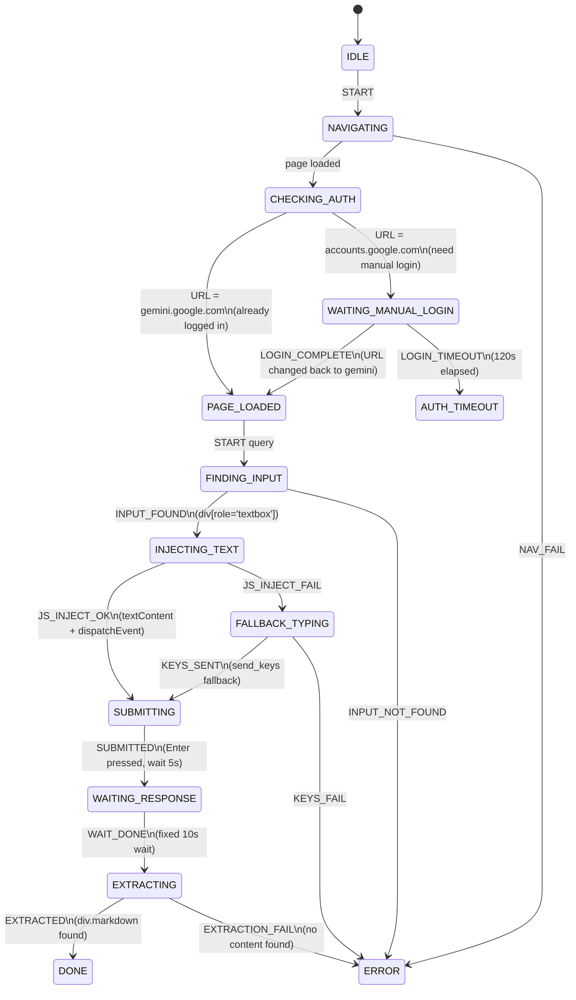
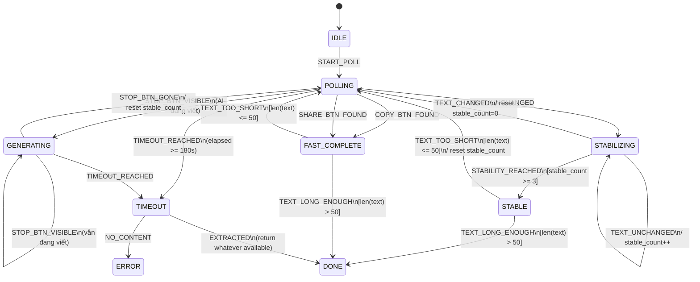
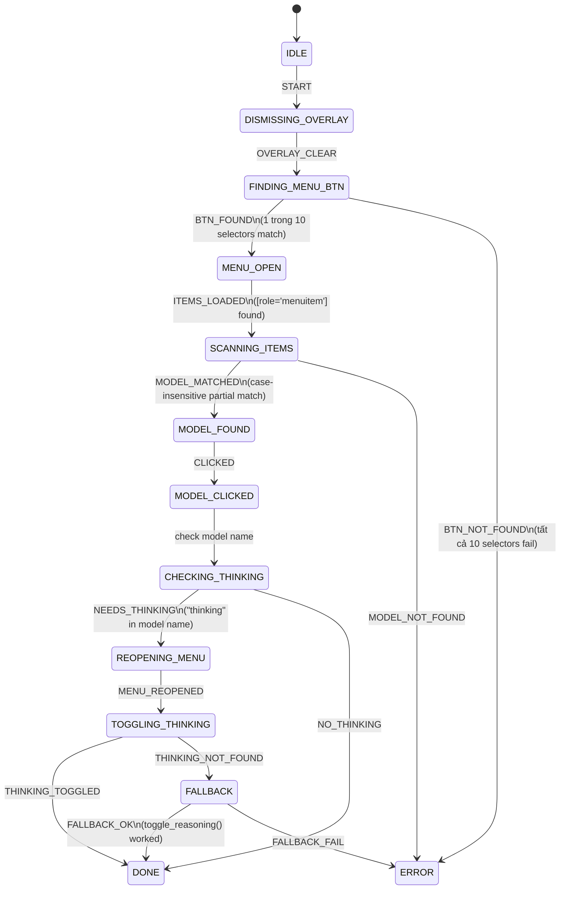
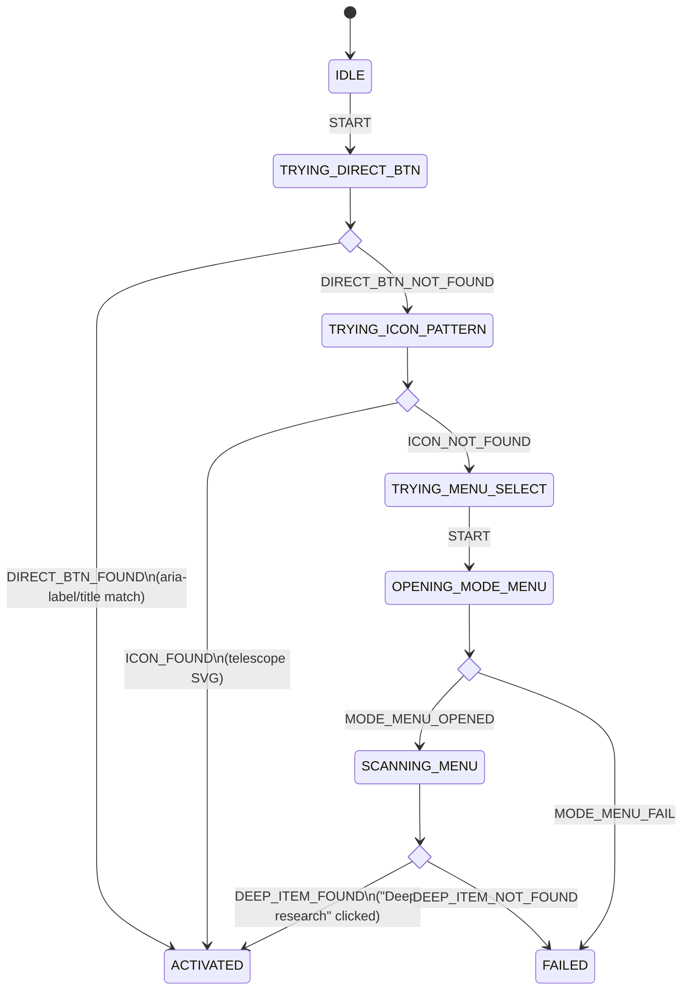

# State Machines - Browser Automator

Tài liệu mô tả toàn bộ state machines cho các thành phần chính của dự án Browser Automator.

---

## Mục lục

1. [Browser Driver Lifecycle](#1-browser-driver-lifecycle)
2. [Request Pipeline](#2-request-pipeline)
3. [Perplexity Query Flow](#3-perplexity-query-flow)
4. [Gemini Query Flow](#4-gemini-query-flow)
5. [Response Extraction (Perplexity)](#5-response-extraction-perplexity)
6. [Model Selection (Perplexity)](#6-model-selection-perplexity)
7. [Deep Research Activation (Perplexity)](#7-deep-research-activation-perplexity)

---

## 1. Browser Driver Lifecycle

Quản lý vòng đời của Chrome WebDriver (persistent driver trong `api_server.py`).

### States

| State | Mô tả |
|-------|--------|
| `IDLE` | Không có driver instance nào tồn tại |
| `CREATING` | Driver đang được khởi tạo (undetected-chromedriver) |
| `ALIVE` | Driver hoạt động bình thường, sẵn sàng nhận query |
| `UNHEALTHY` | Driver không phản hồi (is_driver_alive() = False) |
| `REFRESHING` | Driver cần recycle (đạt ngưỡng 10 requests) |
| `DESTROYING` | Driver đang được shutdown, cleanup processes |
| `ERROR` | Lỗi không thể phục hồi sau max retries (3 lần) |

### Context

| Variable | Type | Mô tả |
|----------|------|--------|
| `retry_count` | int | Số lần retry hiện tại |
| `max_retries` | int (=3) | Số lần retry tối đa |
| `request_count` | int | Số request đã xử lý |
| `max_requests` | int (=10) | Ngưỡng refresh driver |

### Diagram



### Transitions

| Source | Event | Target | Guard | Action | Mô tả |
|--------|-------|--------|-------|--------|--------|
| IDLE | REQUEST_DRIVER | CREATING | - | reset counters | Request đầu tiên trigger tạo driver |
| CREATING | CREATED_OK | ALIVE | - | reset retry | Driver khởi tạo thành công |
| CREATING | CREATED_FAIL | DESTROYING | - | retry_count++ | Khởi tạo thất bại, cleanup trước khi retry |
| ALIVE | HEALTH_CHECK_OK | ALIVE | - | request_count++ | Driver healthy, tăng request counter |
| ALIVE | HEALTH_CHECK_FAIL | UNHEALTHY | - | - | Driver không phản hồi |
| ALIVE | THRESHOLD_REACHED | REFRESHING | request_count >= 10 | - | Đạt ngưỡng refresh |
| ALIVE | DESTROY | DESTROYING | - | - | Shutdown hoặc manual destroy |
| UNHEALTHY | RETRY | CREATING | retry < max | - | Retry tạo driver mới |
| UNHEALTHY | MAX_RETRIES | ERROR | retry >= max | - | Hết retry |
| UNHEALTHY | DESTROY | DESTROYING | - | - | Cleanup driver hỏng |
| REFRESHING | DESTROY | DESTROYING | - | - | Bắt đầu refresh cycle |
| DESTROYING | DESTROYED | IDLE | retry < max | - | Cleanup xong, sẵn sàng tạo mới |
| DESTROYING | DESTROYED | ERROR | retry >= max | - | Cleanup xong nhưng hết retry |
| ERROR | RESET | IDLE | - | reset counters | Phục hồi thủ công |

### Liên quan code

- `api_server.py`: `get_persistent_driver()`, `is_driver_alive()`, `close_persistent_driver()`
- `api_server.py`: `kill_zombie_chrome_processes()`, `cleanup_profile_locks()`
- `drivers/factory.py`: `get_driver()`

---

## 2. Request Pipeline

Xử lý mỗi API request từ khi nhận đến khi trả response.

### States

| State | Mô tả |
|-------|--------|
| `RECEIVED` | Request vừa đến endpoint |
| `AUTHENTICATING` | Đang verify API key (X-API-Key header) |
| `QUEUED` | Chờ browser_lock (chỉ 1 request chạy tại 1 thời điểm) |
| `LOCK_ACQUIRED` | Đã có lock, đang chuẩn bị driver |
| `DRIVER_READY` | Driver alive và đã navigate đến platform |
| `EXECUTING` | Query đang được gửi đến AI platform |
| `EXTRACTING` | Đang chờ và trích xuất response |
| `SAVING` | Đang lưu response vào data/*.json |
| `COMPLETED` | Thành công - response đã trả về caller |
| `AUTH_FAILED` | API key không hợp lệ → HTTP 401 |
| `RETRYING` | Đang retry sau lần thất bại đầu (max 2 attempts) |
| `FAILED` | Lỗi sau khi hết retry → HTTP 500 |

### Diagram



### Liên quan code

- `api_server.py`: endpoints `/query`, `/deep-research`
- `api_server.py`: `verify_api_key()`, `process_with_lock()`, `run_query()`
- Concurrency: `browser_lock = threading.Lock()`, `queue_count`

---

## 3. Perplexity Query Flow

Toàn bộ flow query trên Perplexity, từ navigate đến extract response.

### States

| State | Mô tả |
|-------|--------|
| `IDLE` | Automator vừa được tạo |
| `NAVIGATING` | Đang load perplexity.ai |
| `PAGE_LOADED` | Trang đã sẵn sàng |
| `SELECTING_MODEL` | Đang mở menu và chọn model |
| `MODEL_SELECTED` | Model đã được chọn |
| `TOGGLING_REASONING` | Đang bật/tắt reasoning mode |
| `ENABLING_DEEP_RESEARCH` | Đang kích hoạt deep research |
| `READY_FOR_QUERY` | Tất cả config xong, sẵn sàng nhập query |
| `DISMISSING_OVERLAY` | Nhấn Escape để tắt popup/overlay |
| `FINDING_INPUT` | Đang tìm element `#ask-input` |
| `TYPING_QUERY` | Đang nhập text vào input (send_keys) |
| `SUBMITTING` | Đang nhấn Enter/Return |
| `WAITING_RESPONSE` | Đang poll response (mỗi 3s, max 180s) |
| `EXTRACTING` | Đang parse response từ DOM (.prose) |
| `DONE` | Response đã trích xuất thành công |
| `ERROR` | Lỗi không thể phục hồi |

### Diagram



### Query Retry Loop (trong TYPING_QUERY)

```
Attempt 1 ──fail──► Attempt 2 ──fail──► Attempt 3 ──fail──► ERROR
    │                    │                    │
  success              success              success
    │                    │                    │
    └────────────────────┴────────────────────┘
                         │
                     SUBMITTING
```

Mỗi attempt: Escape → tìm `#ask-input` → scroll → click → focus → clear → send_keys → Enter.

### Liên quan code

- `automators/perplexity.py`: `navigate()`, `query()`, `select_model()`, `toggle_reasoning()`, `enable_deep_research()`, `extract_response()`

---

## 4. Gemini Query Flow

Flow query trên Google Gemini, bao gồm xử lý authentication thủ công.

### States

| State | Mô tả |
|-------|--------|
| `IDLE` | Automator vừa được tạo |
| `NAVIGATING` | Đang load gemini.google.com |
| `CHECKING_AUTH` | Kiểm tra URL có bị redirect sang accounts.google.com |
| `WAITING_MANUAL_LOGIN` | Chờ user đăng nhập thủ công (max 120s) |
| `PAGE_LOADED` | Trang Gemini đã sẵn sàng |
| `FINDING_INPUT` | Đang tìm `div[role='textbox']` |
| `INJECTING_TEXT` | Inject text qua JavaScript (textContent + input event) |
| `FALLBACK_TYPING` | Fallback: dùng send_keys() nếu JS inject thất bại |
| `SUBMITTING` | Nhấn Enter |
| `WAITING_RESPONSE` | Chờ cố định 10s |
| `EXTRACTING` | Parse `div.markdown` containers bằng BeautifulSoup |
| `DONE` | Response trích xuất thành công |
| `AUTH_TIMEOUT` | Timeout đăng nhập thủ công (120s) |
| `ERROR` | Lỗi không phục hồi |

### Diagram



### Text Input Strategy

```
                    ┌─────────────────────┐
                    │   INJECTING_TEXT     │
                    │                     │
                    │  JS: element.text   │
                    │  Content = text     │
                    │  + dispatchEvent    │
                    │  ('input')          │
                    └───────┬─────────────┘
                            │
                    ┌───────┴───────┐
                    │               │
                 SUCCESS          FAIL
                    │               │
                    ▼               ▼
               SUBMITTING    FALLBACK_TYPING
                              (send_keys)
                                   │
                              SUBMITTING
```

**Lý do dùng JS injection**: Gemini có bug với `send_keys()` khi text chứa ký tự đặc biệt (`\n`, `{`, `}`, `:`) — text bị tách thành nhiều message. JS injection bypass hoàn toàn vấn đề này.

### Liên quan code

- `automators/gemini.py`: `navigate()`, `query()`, `extract_response()`

---

## 5. Response Extraction (Perplexity)

Logic polling phức tạp để xác định khi nào response hoàn tất (Perplexity).

### States

| State | Mô tả |
|-------|--------|
| `IDLE` | Chưa bắt đầu polling |
| `POLLING` | Đang check page: Stop btn, Copy btn, Share btn, text content |
| `GENERATING` | Stop button visible → AI đang viết response |
| `STABILIZING` | Text không đổi, đang đếm stability counter |
| `STABLE` | Text ổn định qua 3 polls liên tiếp (9 giây) |
| `FAST_COMPLETE` | Copy/Share button xuất hiện → response hoàn tất ngay |
| `TIMEOUT` | Đã chờ 180s → extract bất kỳ nội dung nào có |
| `DONE` | Response trích xuất thành công |
| `ERROR` | Không có nội dung nào sau timeout |

### Context

| Variable | Type | Mô tả |
|----------|------|--------|
| `poll_interval` | int (=3s) | Khoảng cách giữa các lần poll |
| `max_wait` | int (=180s) | Timeout tối đa |
| `stable_count` | int | Số lần liên tiếp text không đổi |
| `required_stable` | int (=3) | Ngưỡng stability cần đạt |
| `min_length` | int (=50) | Độ dài text tối thiểu cho valid response |
| `last_text` | str | Text response từ poll trước |
| `elapsed` | float | Thời gian đã chờ |

### Diagram



### Polling Logic mỗi cycle (3s)

```
┌──────────────────────────────────────────────────┐
│                  POLL CYCLE                       │
│                                                  │
│  1. JavaScript check:                            │
│     - document.querySelector('[aria-label*=      │
│       "Stop"]') → Stop button?                   │
│     - Animation cursor visible?                  │
│     - document.querySelector('[aria-label*=      │
│       "Copy"]') → Copy button?                   │
│     - document.querySelector('[aria-label*=      │
│       "Share"]') → Share button?                 │
│                                                  │
│  2. BeautifulSoup extract:                       │
│     - soup.select('.prose') → all containers     │
│     - Get text from last container               │
│                                                  │
│  3. Decision:                                    │
│     Copy/Share found + len > 50 → FAST_COMPLETE  │
│     Stop btn visible → GENERATING                │
│     text == last_text → STABILIZING              │
│     text != last_text → POLLING (continue)       │
│     elapsed >= 180s → TIMEOUT                    │
└──────────────────────────────────────────────────┘
```

### Liên quan code

- `automators/perplexity.py`: `extract_response()` — polling loop lines ~200-280

---

## 6. Model Selection (Perplexity)

Chọn AI model trên Perplexity với nhiều fallback selectors.

### States

| State | Mô tả |
|-------|--------|
| `IDLE` | Chưa bắt đầu |
| `DISMISSING_OVERLAY` | Nhấn Escape để tắt popup |
| `FINDING_MENU_BTN` | Thử 10 CSS/XPath selectors để tìm nút menu model |
| `MENU_OPEN` | Menu dropdown model đã mở |
| `SCANNING_ITEMS` | Duyệt qua các `[role='menuitem']` elements |
| `MODEL_FOUND` | Đã tìm thấy model target (case-insensitive partial match) |
| `MODEL_CLICKED` | Đã click chọn model |
| `CHECKING_THINKING` | Kiểm tra model name có chứa "thinking" không |
| `REOPENING_MENU` | Mở lại menu để toggle Thinking |
| `TOGGLING_THINKING` | Đang click option Thinking trong menu |
| `DONE` | Model đã được chọn thành công |
| `FALLBACK` | Dùng `toggle_reasoning()` fallback |
| `ERROR` | Không tìm thấy model hoặc menu |

### Diagram



### 10 Menu Button Selectors (thử tuần tự)

```
Selector 1:  SVG icon with specific path data
Selector 2:  button[aria-label*="model"]
Selector 3:  button[aria-label*="Model"]
Selector 4:  XPath //button[contains(@aria-label, 'Model')]
Selector 5:  XPath //button[contains(@aria-label, 'model')]
Selector 6:  button title attribute
Selector 7:  Generic dropdown button patterns
Selector 8:  button near model display text
Selector 9:  Fallback class-based selectors
Selector 10: Last resort: positional DOM selectors
```

### Thinking Toggle Sub-flow

```
toggle_reasoning(enable=True):

    Try 8 selectors:
    ├── XPath //button[text()='Thinking']
    ├── XPath //*[contains(text(), 'Thinking')]
    ├── [role='switch'][aria-label*='reason']
    ├── [role='switch'][aria-label*='think']
    ├── input[type='checkbox'] near "thinking"
    ├── ... (3 more fallbacks)
    │
    ├── Found switch element:
    │   └── Check aria-checked state
    │       ├── Already correct → done
    │       └── Wrong state → click toggle
    │
    └── Found menu item:
        └── Click directly
```

### Liên quan code

- `automators/perplexity.py`: `select_model()`, `toggle_reasoning()`

---

## 7. Deep Research Activation (Perplexity)

Kích hoạt chế độ Deep Research với 3-strategy fallback cascade.

### States

| State | Mô tả |
|-------|--------|
| `IDLE` | Chưa bắt đầu |
| `TRYING_DIRECT_BTN` | Strategy 1: Tìm button qua aria-label/title chứa "Deep" |
| `TRYING_ICON_PATTERN` | Strategy 2: Tìm telescope SVG icon |
| `TRYING_MENU_SELECT` | Strategy 3: Mở Search mode menu |
| `OPENING_MODE_MENU` | Đang click nút Search mode |
| `SCANNING_MENU` | Đang tìm item "Deep research" trong menu |
| `ACTIVATED` | Deep Research đã được bật thành công |
| `FAILED` | Tất cả 3 strategies đều thất bại |

### Diagram



### 3-Strategy Cascade

```
Strategy 1: Direct Button Discovery
│   Selector: //button[contains(@aria-label, 'Deep')
│             or contains(@title, 'Deep')]
│
├── FOUND → click → ACTIVATED ✓
│
└── NOT FOUND ↓

Strategy 2: Icon Pattern Match
│   Selector: mode_deep_research_direct_btn
│             (XPath for telescope SVG icon path)
│
├── FOUND → click → ACTIVATED ✓
│
└── NOT FOUND ↓

Strategy 3: Menu Selection
│   Step 1: Click Search mode button
│           Selector: mode_search_btn
│
│   Step 2: Find "Deep research" in menu items
│           Match: text contains "Deep" (case-insensitive)
│
├── FOUND → click → ACTIVATED ✓
│
└── NOT FOUND → FAILED ✗
```

### Liên quan code

- `automators/perplexity.py`: `enable_deep_research()`

---

## Tổng hợp

| # | State Machine | States | Transitions | Component |
|---|---------------|--------|-------------|-----------|
| 1 | Browser Driver Lifecycle | 7 | 14 | `api_server.py` |
| 2 | Request Pipeline | 12 | 16 | `api_server.py` |
| 3 | Perplexity Query Flow | 16 | 22 | `automators/perplexity.py` |
| 4 | Gemini Query Flow | 14 | 16 | `automators/gemini.py` |
| 5 | Response Extraction | 9 | 16 | `automators/perplexity.py` |
| 6 | Model Selection | 13 | 16 | `automators/perplexity.py` |
| 7 | Deep Research Activation | 8 | 10 | `automators/perplexity.py` |
| **Tổng** | | **79** | **110** | |

### Mối quan hệ giữa các State Machines

```
                    ┌──────────────────┐
                    │  Request Pipeline │
                    │  (orchestrator)   │
                    └────────┬─────────┘
                             │
              ┌──────────────┼──────────────┐
              │              │              │
              ▼              ▼              ▼
    ┌─────────────┐  ┌─────────────┐  ┌─────────────┐
    │   Browser   │  │  Perplexity │  │   Gemini    │
    │   Driver    │  │  Query Flow │  │  Query Flow │
    │  Lifecycle  │  └──────┬──────┘  └─────────────┘
    └─────────────┘         │
                    ┌───────┼────────┐
                    │       │        │
                    ▼       ▼        ▼
              ┌────────┐ ┌──────┐ ┌──────────┐
              │ Model  │ │ Deep │ │ Response │
              │Select  │ │Rsrch │ │Extraction│
              └────────┘ └──────┘ └──────────┘
```

- **Request Pipeline** là orchestrator chính, gọi **Browser Driver** để đảm bảo driver sẵn sàng
- **Request Pipeline** delegate sang **Perplexity Query** hoặc **Gemini Query** tùy platform
- **Perplexity Query** sử dụng 3 sub-machines: **Model Selection**, **Deep Research**, **Response Extraction**
- **Gemini Query** tự xử lý extraction (đơn giản hơn, chỉ chờ 10s cố định)

---

## Lịch sử kiểm tra & Bugs đã fix

### Kiểm tra ngày 2026-03-04 (nhánh `container`, server 172.104.44.51)

#### Bugs phát hiện và đã fix

| # | Bug | Root Cause | Fix | Commit |
|---|-----|-----------|-----|--------|
| 1 | **ChromeDriver version mismatch** | `undetected-chromedriver` tải ChromeDriver 146, container có Chrome 145 | `drivers/factory.py`: thêm `get_chrome_major_version()` auto-detect và pin `version_main` | `0f7ebfa` |
| 2 | **Zombie Chrome processes** | Python PID 1 không reap child processes trong container | `Dockerfile`: thêm `tini` làm init system | `26d547e` |
| 3 | **Chrome profile corrupt** | Volume mount profile cũ từ image khác bị hỏng → Chrome crash ngay khi khởi tạo | Backup profile cũ, tạo profile mới, login lại | manual |
| 4 | **Cloudflare block** | Perplexity block request từ IP mới của container, cần verify thủ công | Login lại qua VNC, verify Cloudflare | manual |

#### Kết quả kiểm tra theo State Machine

| # | State Machine | Kết quả | Chi tiết |
|---|---------------|---------|----------|
| 1 | Browser Driver Lifecycle | ✅ PASS | Driver khởi tạo OK, auto-detect Chrome 145, health check hoạt động |
| 2 | Request Pipeline | ✅ PASS | Auth reject đúng (no key / wrong key), `/models` trả 13 models |
| 3 | Perplexity Query Flow | ✅ PASS | Navigate → query → extract response hoạt động đúng |
| 4 | Gemini Query Flow | ⚠️ PARTIAL | Query gửi OK nhưng extract thất bại — chưa login Gemini hoặc selector cũ |
| 5 | Response Extraction | ✅ PASS | Response dài extract đầy đủ, không bị cắt |
| 6 | Model Selection | ✅ PASS | Chọn model cụ thể hoạt động đúng |
| 7 | Deep Research | ✅ PASS | `/deep-research` trả response chi tiết với nhiều nguồn |

#### Test Thinking Models (2 lượt, 14/14 pass)

| Model | Lượt 1 | Lượt 2 |
|-------|--------|--------|
| Gemini 3.0 Pro | ✅ | ✅ |
| Kimi K2 Thinking | ✅ | ✅ |
| Gemini 3 Flash Thinking | ✅ | ✅ |
| GPT-5.2 Thinking | ✅ | ✅ |
| Claude Sonnet 4.5 Thinking | ✅ | ✅ |
| Claude Opus 4.5 Thinking | ✅ | ✅ |
| Grok 4.1 Thinking | ✅ | ✅ |

#### Lưu ý vận hành container

- **Khi Chrome profile bị corrupt**: Backup `chrome_profile/`, tạo mới, login lại qua VNC
- **Khi Cloudflare block**: Vào VNC (`http://<server>:6080/vnc.html`, password: `browser123`), verify thủ công
- **Khi ChromeDriver mismatch**: Đã fix vĩnh viễn bằng auto-detect `version_main` trong `drivers/factory.py`
- **Zombie processes**: Đã fix vĩnh viễn bằng `tini` init trong `Dockerfile`
